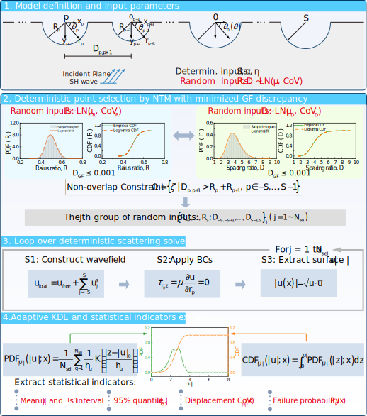

# Stochastic Seismic Response Analysis of Valley Groups Based on Point Estimate and Kernel Density Estimation

[](https://opensource.org/licenses/MIT)

This repository contains MATLAB code for the paper  
**"[Paper Title]"** submitted to *Computers & Geosciences*.  
It implements a stochastic analysis framework that couples **number‑theoretic point selection**, a **deterministic SH‑wave scattering solver**, and **kernel density estimation (KDE)** to quantify the uncertainty of surface ground motion caused by random canyon radii and spacings in a multi‑canyon topography.

> **Note:** Although the ultimate goal is to obtain the probability density function of the response, this method **does not** solve the generalized density evolution equation (GDEE). Instead, it generates representative point sets via low‑discrepancy sequences and assembles the response distribution using adaptive KDE.

  
*Fig. 2: Overall analysis framework coupling stochastic simulation with a deterministic scattering solver.*

## Authors
- [Your Name] ([email] / [ORCID])  
- [Co‑author names if any]

## Requirements
- MATLAB R2019b or later (tested on R2022a)
- Statistics and Machine Learning Toolbox (required for `sobolset`)

## Installation
1. Clone the repository:
   ```bash
   git clone https://github.com/your-username/valley-group-pdem.git
